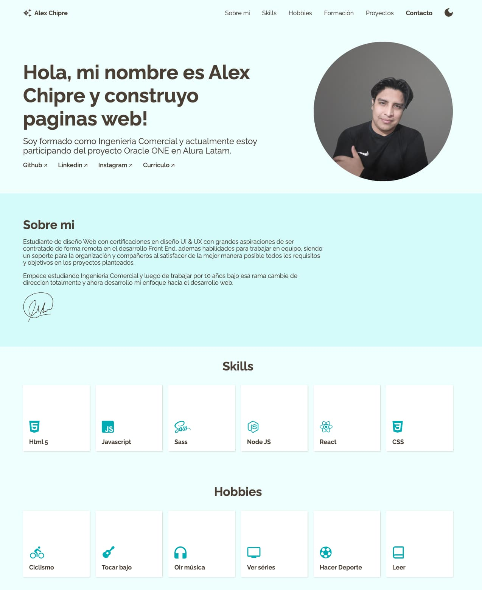

  <svg width="80" height="80" viewBox="0 0 193 225" fill="none" xmlns="http://www.w3.org/2000/svg">
<path d="M178.78 23.25L48.53 0.250008C44.3516 -0.485285 40.0522 0.469054 36.5774 2.90316C33.1025 5.33727 30.7366 9.05183 30 13.23L0.250012 182.23C-0.113858 184.3 -0.0661897 186.422 0.390294 188.474C0.846778 190.526 1.70313 192.468 2.91041 194.189C4.11769 195.91 5.65224 197.376 7.42636 198.503C9.20048 199.631 11.1794 200.398 13.25 200.76L143.5 223.76C145.571 224.125 147.694 224.079 149.747 223.623C151.8 223.167 153.743 222.311 155.465 221.104C157.187 219.896 158.654 218.361 159.782 216.586C160.91 214.812 161.678 212.832 162.04 210.76L191.79 41.76C192.519 37.5803 191.558 33.2822 189.118 29.811C186.678 26.3398 182.96 23.9798 178.78 23.25ZM103.5 115.56C103.173 117.411 102.206 119.087 100.767 120.296C99.3278 121.505 97.5093 122.168 95.63 122.17C95.1608 122.17 94.6924 122.13 94.23 122.05L52.73 114.72C50.7577 114.235 49.0438 113.018 47.9359 111.316C46.8279 109.613 46.4089 107.553 46.7639 105.554C47.1188 103.554 48.2211 101.764 49.8471 100.547C51.4732 99.3298 53.5013 98.7768 55.52 99L97 106.29C98.0358 106.471 99.0258 106.855 99.9132 107.419C100.801 107.983 101.568 108.716 102.172 109.577C102.776 110.438 103.204 111.41 103.431 112.437C103.659 113.463 103.683 114.524 103.5 115.56ZM150.5 91.38C150.174 93.229 149.208 94.9043 147.771 96.1127C146.334 97.3212 144.518 97.9857 142.64 97.99C142.167 97.9909 141.695 97.9474 141.23 97.86L58.23 83.21C56.1401 82.84 54.2828 81.655 53.0666 79.9156C51.8504 78.1762 51.375 76.0249 51.745 73.935C52.115 71.8451 53.3 69.9878 55.0394 68.7716C56.7788 67.5554 58.9301 67.08 61.02 67.45L144.02 82.11C145.057 82.29 146.048 82.6728 146.936 83.2364C147.825 83.8 148.593 84.5333 149.198 85.3944C149.803 86.2555 150.232 87.2274 150.46 88.2545C150.689 89.2816 150.713 90.3437 150.53 91.38H150.5ZM156.05 59.86C155.723 61.7107 154.756 63.3873 153.317 64.596C151.878 65.8046 150.059 66.4681 148.18 66.47C147.711 66.4694 147.242 66.4292 146.78 66.35L63.78 51.69C62.7216 51.5342 61.7052 51.1678 60.7909 50.6123C59.8766 50.0568 59.083 49.3235 58.4571 48.4559C57.8311 47.5883 57.3856 46.604 57.1467 45.5612C56.9079 44.5184 56.8807 43.4382 57.0666 42.3847C57.2526 41.3312 57.648 40.3256 58.2294 39.4276C58.8108 38.5295 59.5664 37.7572 60.4515 37.1564C61.3367 36.5555 62.3333 36.1382 63.3825 35.9293C64.4318 35.7204 65.5122 35.724 66.56 35.94L149.56 50.59C150.598 50.7689 151.59 51.1508 152.479 51.7139C153.369 52.277 154.139 53.0101 154.745 53.8714C155.35 54.7326 155.78 55.7049 156.009 56.7326C156.238 57.7602 156.262 58.823 156.08 59.86H156.05Z" fill="#9AA"/>
</svg>

  <h1>Proyect Resumen CV</h1>
  
<em>This project is a Alura's challeges</em>

 

 ##  About the Project 
 

 
 
This project was developed my resumen with some features that I learned in my road as a web developer Frontend and my experience with the school the Alura. 
 
 

## Characteristics 👷🏼‍♂️

The characteristics to deploit this page are the followings:
 

  * That It' was resposive
  * that persevere with localStorage
  * With some animations

 
 

## Built 👷🏼‍♂️

The technologies and tools used to develop this website are: 
 

| Tools | Languages |
---|---|
| VSCode| Html|
| Chrome| CSS|
| Git| Javascript|
| Figma| 

 
 

## Inspiration 🔗

As I said this page is inspired by the Alura's challenge where I have practiced with several technologies and I got their respective links.

 

### This Challeges:
* 🔗 Link: https://achipre.github.io/resumen-challenge/
* 📦 Repository: https://github.com/achipre/resumen-challenge

 
 

## Other Challeges:

### 1) Landing Page: Frontendmentor's challenge

* 🔗 Link: https://achipre.github.io/landing-page-basic
* 📦 Repository: https://github.com/achipre/landing-page-basic
* 💎 FrontendMentor: https://www.frontendmentor.io/challenges/skilled-elearning-landing-page-S1ObDrZ8q
### 2) Product Card: Frontendmentor's challenge
* 🔗 Link: https://achipre.github.io/product-preview-basic
* 📦 Repository: https://github.com/achipre/product-preview-basic
* 💎 FrontendMentor: https://www.frontendmentor.io/challenges/product-preview-card-component-GO7UmttRfa

### 3) Results Summary: Frontendmentor's challenge
* 🔗 Link: https://achipre.github.io/results-summary-component
* 📦 Repository: https://github.com/achipre/results-summary-component
* 💎 FrontendMentor: https://www.frontendmentor.io/challenges/results-summary-component-CE_K6s0maV

### 4) Proyect Encrypt and Desencrypt List: Alura's challenge
* 🔗 Link: https://achipre.github.io/encriptaydesencripta
* 📦 Repository: https://github.com/achipre/encriptaydesencripta

### 5) Proyect To-do List: Alura's challenge
* 🔗 Link: https://achipre.github.io/todo-list-basic/
* 📦 Repository: https://github.com/achipre/todo-list-basic

### 6) Proyect basic CRUD: Alura's challenge
* 🔗 Link: https://achipre.github.io/project-basic-CRUD
* 📦 Repository: https://github.com/achipre/project-basic-CRUD

